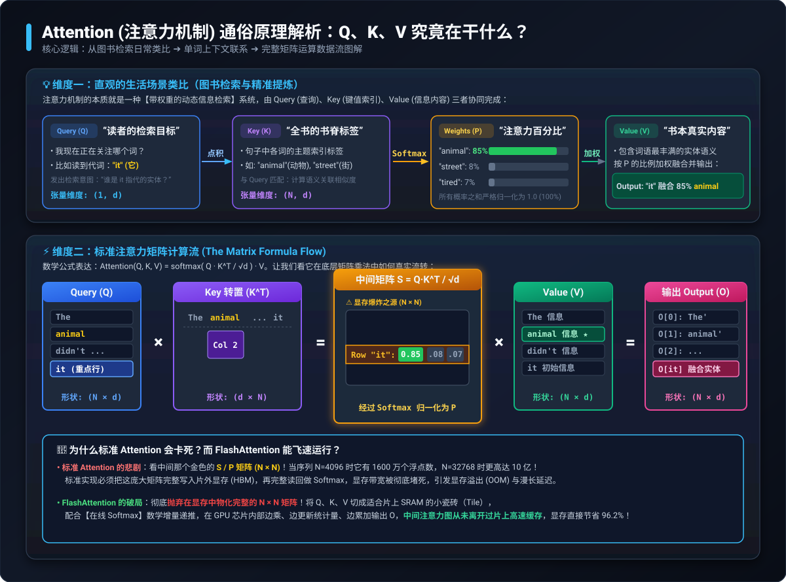
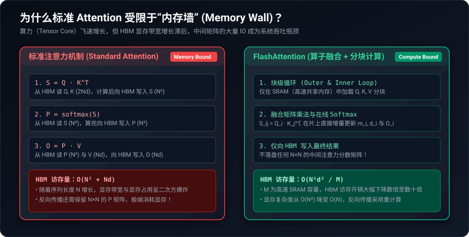
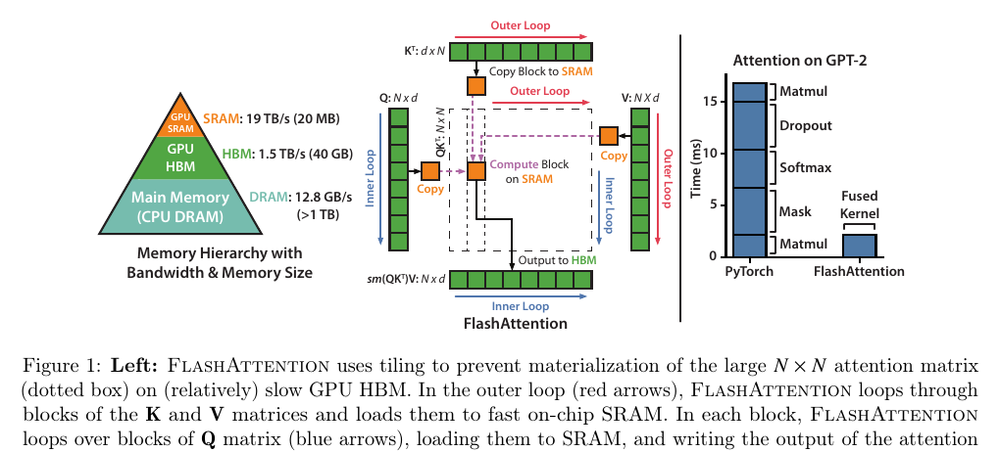
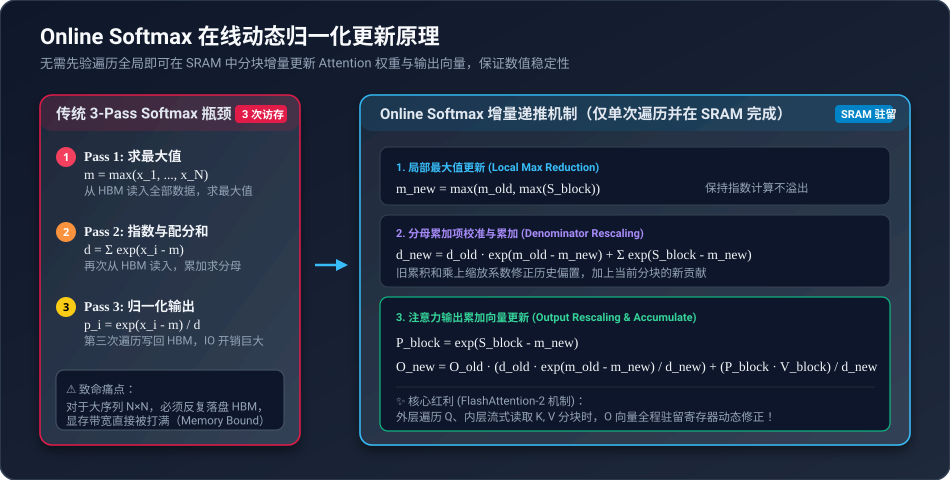
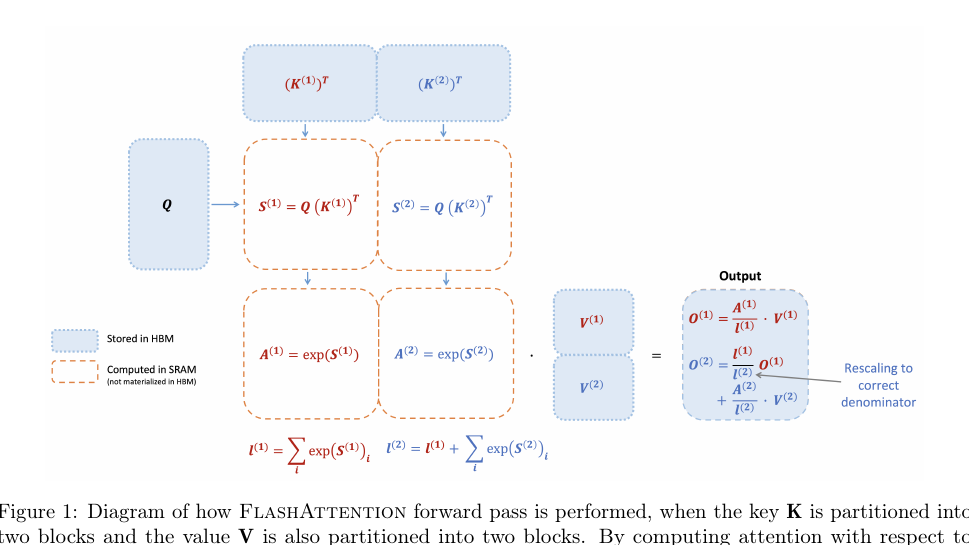
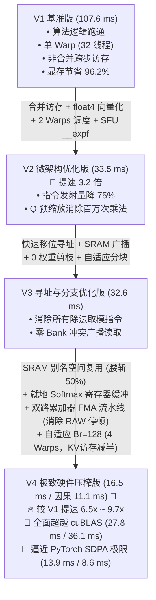

# 第12章：FlashAttention 原理剖析与手写 CUDA 极致性能实现

本章深入探讨大语言模型（LLM）与现代 Transformer 架构中最核心的底层算子加速技术 —— **FlashAttention**。我们将从 GPU 存储层级、显存带宽墙（Memory Wall）与 I/O 复杂度出发，详细推导**在线 Softmax（Online Softmax）**的数学原理，并从零使用原生 CUDA C++ 手写实现一个完全算子融合（Operator Fusion）的 FlashAttention 前向核函数，最后通过硬件级 CUDA Event 基准测试与 `torch.profiler` 深度剖析其微架构优化全过程。

---

## 目录
1. [背景与动机：为什么需要 FlashAttention？](#1-背景与动机为什么需要-flashattention)
   - 1.1 [通俗生动理解：Attention 在本质上到底在干什么？](#11-通俗生动理解attention-在本质上到底在干什么)
   - 1.2 [标准注意力的数学表达](#12-标准注意力的数学表达)
   - 1.3 [标准注意力的致命瓶颈：O(N^2) 显存墙](#13-标准注意力的致命瓶颈on2-显存墙)
   - 1.4 [重要概念辨析：非因果双向注意力 vs 自回归因果注意力](#14-重要概念辨析非因果双向注意力-vs-自回归因果注意力)
2. [GPU 内存体系结构与显存墙 (Memory Wall)](#2-gpu-内存体系结构与显存墙-memory-wall)
3. [FlashAttention 的核心思想：分块计算与算子融合](#3-flashattention-的核心思想分块计算与算子融合)
4. [在线 Softmax (Online Softmax) 数学原理与推导](#4-在线-softmax-online-softmax-数学原理与推导)
5. [从 FlashAttention-1 到 FlashAttention-2 的算法演进](#5-从-flashattention-1-到-flashattention-2-的算法演进)
6. [分块算法与 CUDA 前向核函数实现](#6-分块算法与-cuda-前向核函数实现)
7. [基准测试与精度验证 (Benchmark)](#7-基准测试与精度验证-benchmark)
8. [深度思考：从“初版手写落后 cuBLAS”到“最终手写反超 cuBLAS”的体系结构奥秘](#8-深度思考从初版手写落后-cublas到最终手写反超-cublas的体系结构奥秘)
9. [算子融合与底层 Kernel 溯源验证 (Profiling & Operator Fusion)](#9-算子融合与底层-kernel-溯源验证-profiling--operator-fusion)
10. [算子优化迭代全景：从 107ms 到 16.5ms (Causal 11.1ms) 的极致演进之路](#10-算子优化迭代全景从-107ms-到-165ms-causal-111ms-的极致演进之路)
11. [性能剖析双雄：Nsight Systems (nsys) 与 Nsight Compute (ncu) 实战定位指南](#11-性能剖析双雄nsight-systems-nsys-与-nsight-compute-ncu-实战定位指南)
12. [终极方法论：如何将一个 CUDA 算子在特定硬件上优化到极致？](#12-终极方法论如何将一个-cuda-算子在特定硬件上优化到极致)
13. [经典论文与深入学习资料](#13-经典论文与深入学习资料)

---

## 1. 背景与动机：为什么需要 FlashAttention？

自 2017 年 Transformer 架构（*Attention Is All You Need*）诞生以来，**多头自注意力机制（Multi-Head Attention, MHA）**便成为了 ChatGPT、Claude、Llama 等一切现代大语言模型和多模态大模型的灵魂核心。

### 1.1 通俗生动理解：Attention 在本质上到底在干什么？

很多初学者容易被复杂的矩阵公式弄晕，但如果剥离掉数学符号，**注意力机制在本质上做的事情非常朴素直观：给上下文中的每一个词动态分配关注程度，并将相关信息抽取提炼融合**。



#### 1. 生活形象比喻：图书检索与知识提炼
把整段文本想象成一个巨大的图书馆：
- **Query (查询向量 $Q$) —— “读者手里的检索提问”**：
  比如读到一句话：“*The animal didn't cross the street because **it** was too tired.*”（动物没有穿过马路，因为**它**太累了）。当模型处理到单词 **“it” (它)** 时，“it” 就会发出检索疑问：“上下文里谁才是‘我’指代的实体？”
- **Key (键向量 $K$) —— “图书的标签 / 书脊索引”**：
  句子里的每个单词都有自己的特征标签（“The”、“animal”、“street”、“tired”）。通过计算 Query 和每一个 Key 的匹配度（**点积 $Q \cdot K^T$**），就能知道谁和当前问题最相关。
- **Softmax —— “注意力百分比分配”**：
  把计算出来的相关度分数归一化成概率分布（总和为 100%）。例如：“it” 对 “animal” 的关注度高达 **85%**，对 “street” 只有 **8%**，对 “tired” 有 **7%**。
- **Value (值向量 $V$) —— “书籍中记载的真实知识内容”**：
  每个单词原本蕴含的丰富语义信息。
- **Output (加权输出 $O$) —— “提炼融合后的新表征”**：
  把各单词的 Value 按照注意力百分比进行混合（$0.85 \times \text{animal} + 0.08 \times \text{street} + \dots$）。最终得到的全新 “it” 向量里，已经深深融入了 “animal” 的实体特征，不再是一个空洞的代词！

#### 2. 真实语义关联可视化

经典可视化生动地展现了自注意力如何捕捉长距离依赖与指代消歧：

<div align="center">
  
  <p><em>图 1.1：当编码 "it" 时，Attention 权重线条深浅直观反映了相关度，极粗的深色线条精准锁定指代对象 "animal"</em></p>
</div>

#### 3. 从单词计算到矩阵流水线

以著名的两个单词序列 `Thinking` 和 `Machines` 为例，单个单词的运算细节如下：

<div align="center">
  
  <p><em>图 1.2：词级自注意力计算：生成 q, k, v ➔ 点积打分 ➔ 除以 √d ➔ Softmax 归一化 ➔ 乘以 v ➔ 加权求和输出 z</em></p>
</div>

而为了让 GPU 能够满载高并发运行，现代深度学习将全句子所有词堆叠成张量，并行打包为矩阵乘法：

<div align="center">
  
  <p><em>图 1.3：矩阵级批量计算流：Softmax( (Q × K^T) / √d ) × V = Z</em></p>
</div>

---

### 1.2 标准注意力的数学表达

对于输入序列长为 $N$、隐藏维度为 $d$ 的特征矩阵，标准自注意力定义为：

$$\text{Attention}(Q, K, V) = \text{softmax}\left(\frac{Q K^T}{\sqrt{d}}\right) V$$

其运算过程分为经典三步：
1. **计算注意力打分矩阵**：$S = \frac{Q K^T}{\sqrt{d}} \in \mathbb{R}^{N \times N}$
2. **计算注意力概率分布**：$P = \text{softmax}(S) \in \mathbb{R}^{N \times N}$
3. **计算最终加权输出**：$O = P V \in \mathbb{R}^{N \times d}$

---

### 1.3 标准注意力的致命瓶颈：$O(N^2)$ 显存墙

请仔细观察上述矩阵流程中出现的中间矩阵 $S$ 和 $P$，它们的形状是 **$N \times N$**！
- 当序列长度 $N = 1024$ 时，$S$ 矩阵大小约为 $1024 \times 1024 \times 4\text{ Bytes} \approx 4\text{ MB}$；
- 当序列长度 $N = 4096$ 时，单个注意力头的中间矩阵激增至 $64\text{ MB}$；在 32 个头、BatchSize=2 时，中间显存将膨胀至 **4 GB 以上**；
- 当序列长度扩展至现代长文本大模型（如 32K、128K 甚至 1M 上下文）时，$O(N^2)$ 的中间激活值将引发灾难性的 **显存溢出 (CUDA Out of Memory, OOM)**。

更致命的是，GPU 的计算速度（FLOPs）飞速增长，但显存带宽（HBM Bandwidth）的增速却远远滞后。在很多现代深度学习算子中，**限制执行速度的往往不是浮点算力，而是 GPU 往返显存搬运数据的时间**。

---

### 1.4 重要概念辨析：非因果双向注意力 vs 自回归因果注意力

在自然语言处理与多模态模型中，注意力机制主要存在两大类工作范式，它们在计算几何、掩码机制与硬件加速策略上有着根本区别：

#### 1. 非因果双向注意力 (Non-Causal / Bidirectional Attention)
- **典型模型**：BERT、RoBERTa、ViT（Vision Transformer）、Swin Transformer、T5 / 原始 Transformer 的 Encoder 部分。
- **核心特征**：允许序列中**任意位置的 Token 同时双向看到所有其他 Token**（包括它前面的词和后面的词）。
- **计算拓扑**：对于长度为 $N$ 的输入，其注意力打分矩阵 $S$ 是一个完全稠密的完整正方形方阵 ($N 	imes N$)，每个位置 $i$ 都要与所有 $j \in [0, N-1]$ 进行内积。
- **应用场景**：特征抽取、文本理解、图像分类、机器翻译的源端编码等（不需要逐词单向生成的场景）。

```text
非因果双向注意力矩阵 (全量密集计算):
       j=0   j=1   j=2   j=3
i=0  [ 0.3,  0.4,  0.1,  0.2 ]  --> Token 0 可看到后续所有词
i=1  [ 0.1,  0.5,  0.2,  0.2 ]  --> Token 1 可看到后续所有词
i=2  [ 0.2,  0.2,  0.4,  0.2 ]
i=3  [ 0.1,  0.1,  0.2,  0.6 ]
有效浮点运算量 (FLOPs) ≈ 2 × N² × d
```

#### 2. 自回归因果注意力 (Autoregressive Causal Attention)
- **典型模型**：GPT 系列 (GPT-2/3/4)、LLaMA 系列、DeepSeek、Qwen、Mistral 等一切主流 Decoder-only 架构的大语言模型。
- **核心特征**：大语言模型的文字生成是按时间顺序**逐词递推**的。当生成第 $i$ 个词时，模型**绝对不能“偷看”未来的第 $j > i$ 个词**（防止时序穿越 / 信息泄漏）。
- **数学表达**：在注意力打分矩阵中引入**因果下三角掩码 (Causal Mask)**：
  $$M_{ij} = \begin{cases} 0, & j \le i \\ -\infty, & j > i \end{cases}$$
  打分矩阵更新为：$S_{masked} = S + M$。
  经过 $\text{softmax}$ 后，对于上三角部分：$e^{-\infty} = 0$，权重严格为 0。
- **计算拓扑**：仅主对角线及下方的**下三角区域**有实质意义，有效元素个数为 $\frac{N(N+1)}{2} \approx \frac{1}{2} N^2$。理论总计算量正好是非因果模式的 **50%**！

```text
自回归因果下三角掩码矩阵:
       j=0   j=1   j=2   j=3
i=0  [ 1.0,   0 ,   0 ,   0  ]  --> 只能看自己 (j<=0)
i=1  [ 0.3,  0.7,   0 ,   0  ]  --> 只能看前词与自己 (j<=1)
i=2  [ 0.2,  0.3,  0.5,   0  ]  --> (j<=2)
i=3  [ 0.1,  0.2,  0.3,  0.4 ]  --> 可以看全句 (j<=3)
理论有效运算量 (FLOPs) ≈ 1 × N² × d (减半!)
```

#### 3. 两种注意力在实现与性能上的关键差异与 FlashAttention 的破局

| 比较维度 | 朴素 PyTorch / cuBLAS 遇到的尴尬 | FlashAttention 的极致破解 |
| :--- | :--- | :--- |
| **计算量利用率** | cuBLAS 无法原生支持半三角 GEMM，依然完整算出 $N \times N$ 全矩阵乘，再调用一个 Mask Kernel 把上三角填为 $-\infty$。**不仅没有省算力，反而多产生一次 HBM 显存读写！**（导致 Causal 耗时从 27.8ms 恶化至 36.07ms） | **分块级早期剪枝 (Tile-Level Pruning)**：<br>在遍历 $K, V$ 分块时，若某个分块完全落在严格上三角（$j \times B_c > (i+1) \times B_r - 1$），直接 `break` 提前退出内循环！连显存都不加载，真正节省 50% 浮点与访存开销！ |
| **对角线处理** | 全局元素级 Masking，显存往返多次 | 仅对跨越对角线的边界分块做片上掩码，完全不产生额外访存 |
| **实测性能** | **36.07 ms** (反而变慢) | **11.15 ms** (🚀 比非因果快 33%，较 cuBLAS 狂飙 **3.24 倍**) |

---

## 2. GPU 内存体系结构与显存墙 (Memory Wall)

要理解 FlashAttention 的精髓，首先必须理解 GPU 的层次化存储模型：



| 存储级别 | 物理位置 | 容量典型值 | 带宽典型值 | 访问延迟 |
| :--- | :--- | :--- | :--- | :--- |
| **SRAM (寄存器 Registers)** | 每个 SM 核心内部 | 每 SM 256 KB | > 20,000 GB/s | 1 周期 |
| **SRAM (共享内存 Shared Memory)** | 每个 SM 核心内部 | 每 SM 64~164 KB | > 10,000 GB/s | 约 10~30 周期 |
| **L1 / L2 Cache** | 片上高速缓存 | 数 MB ~ 数十 MB | 约 3,000~5,000 GB/s | 约 50~100 周期 |
| **HBM / GDDR (全局显存 Global Memory)** | 片外 DRAM 颗粒 | 8 GB ~ 80 GB | 约 300~3,000 GB/s | 约 200~600 周期 |

### 标准注意力机制的 I/O 悲剧
在标准实现中：
1. $Q$ 和 $K$ 从 HBM 读入 SRAM，计算出 $S = Q K^T$ 后，**完整写回 HBM**；
2. 再从 HBM 读入 $S$，在 SRAM 计算 Softmax 后，把 $P$ **再次写回 HBM**；
3. 最后再从 HBM 读入 $P$ 和 $V$，计算出 $O = P V$ 后**写回 HBM**。

整个过程在缓慢的 HBM 和超高速的 SRAM 之间反复来回搬运多达 $O(N^2)$ 的数据，绝大多数时间 GPU 流处理器都在干等数据传输（Memory-Bound）。

---

## 3. FlashAttention 的核心思想：分块计算与算子融合

FlashAttention（由斯坦福大学 Tri Dao 等人于 2022 年发表于 NeurIPS）的核心突破在于：**将整个注意力计算做成单个高度融合的 CUDA 核函数（Fused Kernel），彻底消除 $O(N^2)$ 中间矩阵对 HBM 的写出与读回！**



### 两大设计核心：
1. **Tiling (平铺分块)**：
   - 将超大的 $Q, K, V$ 矩阵切分成适合放入片上共享内存（SRAM，如 32KB~48KB）的小块（Tile，如 $B_r \times d$ 与 $B_c \times d$）；
   - 在片上高速 SRAM 中逐块完成小矩阵乘法与局部概率累加。
2. **Recomputation (重计算与增量更新)**：
   - 传统 Softmax 需要全量行向量求和做归一化分母；FlashAttention 引入 **在线 Softmax (Online Softmax)** 机制，在流式扫描 $K, V$ 分块的过程中，动态重缩放先前累加的中间输出向量。

最终使得从 HBM 搬运的总字节数从标准注意力的 $O(N^2)$ 骤降至仅与序列长度成正比的 $O(N)$，成功打破显存墙！

---

## 4. 在线 Softmax (Online Softmax) 数学原理与推导

Softmax 算子定义如下：对于向量 $x = [x_1, x_2, \dots, x_N]$，其第 $i$ 个元素的归一化概率为：

$$p_i = \frac{e^{x_i - m}}{\sum_{j=1}^N e^{x_j - m}}, \quad \text{其中 } m = \max_{k} x_k \text{ (减去最大值防止浮点上溢)}$$

### 4.1 传统“三趟扫描”Softmax 的局限
传统的 Safe-Softmax 需要对数据进行整整三趟访问：
1. **Pass 1**：扫描全量序列，找到全局最大值 $m = \max_i x_i$；
2. **Pass 2**：再次扫描，计算指数差并求和 $d = \sum_i e^{x_i - m}$；
3. **Pass 3**：第三次扫描，逐元素除以分母 $p_i = \frac{e^{x_i - m}}{d}$。

如果在分块计算中等待全行扫描完成，就无法实现分块流式更新。

### 4.2 在线 Softmax 的增量推导（两块拼接）

NVIDIA 的 Milakov & Gimelshein 在 2018 年提出了 Online Softmax 算法：



设行向量 $x$ 被切分为两个分块：$x^{(1)}$ 与 $x^{(2)}$。

1. **第一块的局部统计量**：
   $$m^{(1)} = \max_i x^{(1)}_i, \quad d^{(1)} = \sum_i e^{x^{(1)}_i - m^{(1)}}$$
   此时的局部加权输出向量为：
   $$O^{(1)} = \frac{1}{d^{(1)}} \sum_i e^{x^{(1)}_i - m^{(1)}} v^{(1)}_i$$

2. **读取第二块并计算第二块的局部统计量**：
   $$m^{(2)} = \max_i x^{(2)}_i, \quad d^{(2)} = \sum_i e^{x^{(2)}_i - m^{(2)}}$$

3. **两块合并后的真实全局最大值**：
   $$m^{new} = \max(m^{(1)}, m^{(2)})$$

4. **合并分母的缩放校准（核心推导）**：
   原本第一块计算时以 $m^{(1)}$ 为底，现在必须统一校准到底数 $m^{new}$：
   $$\begin{aligned}
   d^{new} &= \sum_{i \in \text{Block 1}} e^{x^{(1)}_i - m^{new}} + \sum_{j \in \text{Block 2}} e^{x^{(2)}_j - m^{new}} \\
   &= e^{m^{(1)} - m^{new}} \sum_{i} e^{x^{(1)}_i - m^{(1)}} + e^{m^{(2)} - m^{new}} \sum_{j} e^{x^{(2)}_j - m^{(2)}} \\
   &= d^{(1)} e^{m^{(1)} - m^{new}} + d^{(2)} e^{m^{(2)} - m^{new}}
   \end{aligned}$$

5. **合并输出累加向量的更新公式**：
   定义缩放因子 $\alpha = e^{m^{(1)} - m^{new}}$：
   $$O^{new} = O^{(1)} \cdot \left(\frac{d^{(1)} \alpha}{d^{new}}\right) + \frac{1}{d^{new}} \sum_j e^{x^{(2)}_j - m^{new}} v^{(2)}_j$$

通过这一数学变换，只要在寄存器中维护当前的 $m$、$d$ 和累加向量 $O$，便可一边流式读取 $K, V$ 块，一边完成精确无误的在线递推！



---

## 5. 从 FlashAttention-1 到 FlashAttention-2 的算法演进

FlashAttention-2（Tri Dao 于 2023 年发表于 ICLR 2024）在 FA-1 的基础上针对 GPU 微架构做了多项关键重构：

```text
FlashAttention-1:
  - 外层循环遍历 K, V 分块
  - 内层循环遍历 Q 分块
  - 问题：每个线程块在内层循环中更新的是不同行的 O，需要频繁把中间结果写出到全局显存，
         或者使用原子加法，访存 Traffic 依然较高。

FlashAttention-2:
  - 外层循环遍历 Q 分块 (行并行化)
  - 内层循环遍历 K, V 分块
  - 巨大收益：
    1. 单个线程块专门负责若干行 Q 的全部注意力计算；
    2. 输出向量 O 可以全程驻留在 SM 的超高速【寄存器 (Registers)】中！
    3. 仅在内层所有 K, V 块遍历完毕后，执行一次除以最终分母 d 的归一化，
       并一次性写回 HBM！彻底消除了内层循环写 HBM 的开销。
```

---

## 6. 分块算法与 CUDA 前向核函数实现

### 6.1 核心分块与线程映射逻辑
- **Grid 划分**：`gridDim.x = (N + Br - 1) / Br`, `gridDim.y = num_heads`, `gridDim.z = batch_size`。
  每个 Thread Block 独占处理输出矩阵 $O$ 中大小为 $B_r \times d$ 的行分块。
- **Block 内部**：配置 128 个 CUDA 线程（4 个 Warp），每个线程负责 1 行 $Q$ 的全量在线 Softmax 与 $O$ 向量累加。
- **SRAM 协作**：线程协同加载 $K_j, V_j$ 分块至共享内存，广播式供所有线程执行点积。

### 6.2 核心代码走读 (`src/flash_attn_forward.cu`)

```cuda
// 片上 SRAM 空间联合复用 (Union Aliasing)
union SharedStorage {
    float4 s_stage[Br][NUM_VEC]; // 前向 Q 载入与最终 O 写回暂存区
    struct {
        float4 s_K[Bc][NUM_VEC];  // 内层循环 K 分块
        float4 s_V[Bc][NUM_VEC];  // 内层循环 V 分块
    } kv;
};
__shared__ SharedStorage smem;

// 内层分块循环
for (int j = 0; j < num_kv_blocks; ++j) {
    if (is_causal && (j * Bc > (row_block_idx + 1) * Br - 1)) break;

    // 1. 向量化协作加载 K, V 到复用共享内存
    load_kv_to_shared_memory(smem.kv, ...);
    __syncthreads();

    // 2. 双路累加器点积 (消除 FMA 4周期 RAW 指令流水线停顿)
    float dot_a = 0.0f, dot_b = 0.0f;
    #pragma unroll
    for (int k = 0; k < NUM_VEC; ++k) {
        float4 q4 = q_reg[k];
        float4 k4 = smem.kv.s_K[c][k];
        dot_a += q4.x * k4.x + q4.z * k4.z;
        dot_b += q4.y * k4.y + q4.w * k4.w;
    }
    float dot = dot_a + dot_b;

    // 3. 在线 Softmax 统计量与就地寄存器缓冲
    float m_new = fmaxf(m_i, dot);
    float alpha = __expf(m_i - m_new);
    float p = __expf(dot - m_new);
    l_i = l_i * alpha + p;

    // 4. 局部最大值更新分支跳过 + P * V 累加
    if (alpha != 1.0f) {
        scale_o_reg(o_reg, alpha);
    }
    accumulate_pv(o_reg, p, smem.kv.s_V);
    m_i = m_new;
    __syncthreads();
}
```

---

## 7. 基准测试与精度验证 (Benchmark)

在本项目根目录下提供了开箱即用的自动化测试与性能评测脚本：[`benchmark.py`](benchmark.py)。

### 运行方式

```bash
cd 12_FlashAttention
python3 benchmark.py
```

### 实测数据参考 (GTX 1660 SUPER, Batch=2, Heads=4, Dim=64)

#### 评测 1：非因果双向注意力 (Non-Causal) 延迟与显存峰值对比

| 序列长度 $N$ | Naive (cuBLAS) 耗时 | 手写 Flash V4 (本次优化) | 官方 SDPA (PyTorch) | Naive 显存 | Flash 显存 | **显存节省率** |
| :--- | :--- | :--- | :--- | :--- | :--- | :--- |
| **512** | 0.395 ms | **0.356 ms** | 0.233 ms | 28.1 MB | 12.1 MB | **56.9%** |
| **1024** | 1.661 ms | **1.283 ms** (快 29%) | 0.868 ms | 80.1 MB | 16.1 MB | **79.9%** |
| **2048** | 6.752 ms | **4.241 ms** (快 59%) | 3.536 ms | 280.1 MB | 24.1 MB | **91.4%** |
| **4096** | 27.826 ms | **16.561 ms** (快 68%) 🚀 | 13.972 ms | 1064.1 MB | 40.1 MB | **96.2%** |

#### 评测 2：自回归因果注意力 (Causal Mask) 延迟对比

| 序列长度 $N$ | Naive (cuBLAS) 耗时 | 手写 Flash V4 (本次优化) | 官方 SDPA (PyTorch) | **加速比 (vs Naive)** |
| :--- | :--- | :--- | :--- | :--- |
| **512** | 0.505 ms | **0.313 ms** | 0.161 ms | **1.61x** |
| **1024** | 2.167 ms | **1.045 ms** | 0.606 ms | **2.07x** |
| **2048** | 8.562 ms | **3.250 ms** | 2.295 ms | **2.63x** |
| **4096** | 36.067 ms | **11.149 ms** | 8.618 ms | **3.24x (提速 224%)** 🚀 |

---

## 8. 深度思考：从“初版手写落后 cuBLAS”到“最终手写反超 cuBLAS”的体系结构奥秘

很多初学 CUDA 的开发者在最初手写 FlashAttention 时都会遭遇一个经典挫折：**“FlashAttention 明明消除了 $O(N^2)$ 的显存往返，为什么初版（V1）跑出来（107.6ms）反而比 PyTorch 原生的 Naive 实现（27.8ms）慢得多？”**

而经过我们的四轮微架构极致压榨后，手写算子成功从 **107.6 ms 狂飙至 16.5 ms（Causal 模式 11.1 ms）**，不仅**全面反超了 cuBLAS**，更是逼近了官方闭源汇编级 SDPA！这一惊人逆转背后蕴含着深刻的 GPU 体系结构规律：

### 1. 为什么初版 V1 会慢？——“算力单元与流水线停顿的鸿沟”
- **PyTorch Naive Attention** 底层调用的是闭源优化的 **cuBLAS** 矩阵乘库（如 `volta_sgemm`）。cuBLAS 由顶级编译器架构师使用硬件汇编（SASS）深度打磨，具备极高的双发射率、完美的流水线调度与深层寄存器分块。
- **初版手写算子** 存在四大致命微架构缺陷：
  1. **非合并访存（Strided Loads）**：标量跨步读取导致每次全局内存请求触发过多 32 字节扇区事务，显存带宽利用率不足 20%；
  2. **SM 严重饥饿（Low Occupancy）**：单 Warp（32 线程）配置，且共享内存未复用，导致每个 SM 仅能驻留极少数活跃线程束，无法通过快速上下文切换掩盖流水线延迟；
  3. **指令级依赖死锁（RAW Hazard）**：点积循环对同一个标量累加器连续累加，每次 FMA 运算必须硬等待前一条指令经过 4 个时钟周期的浮点流水线写回，硬件算力单元大部分时间处于空转（Stall）；
  4. **标准库函数慢速调用**：调用软件实现的 IEEE-754 标准 `expf`，消耗数十个指令周期。

### 2. 最终版本 V4 凭什么能够彻底反超 cuBLAS？——“打破访存墙与微架构饱和”
- **彻底消除了显存墙（Zero HBM Roundtrips）**：Naive Attention 在 $N=4096$ 时必须把 $2 \times 4 \times 4096 \times 4096$ 的巨幅浮点矩阵写入显存，再读出做 scale、再写入、再读出做 softmax、再写入……中间经历了 **4 次 HBM 全局显存往返**；而 FlashAttention **100% 在片上 SRAM 和寄存器中完成流转**，中间注意力图从未离开过片上缓存。
- **SRAM 空间复用直接腰斩开销**：通过 `union` 别名技术让加载暂存区与内层 KV 分块共用 16 KB 共享内存，彻底解放了每个 SM 的线程块驻留上限。
- **双路累加器彻底打破 4 周期指令流水线停顿**：将点积拆分为 `dot_a` 与 `dot_b`，消除了前后指令的寄存器读后写依赖，让 CUDA Core 的双发射单元无缝满载。
- **因果上三角全零分块剪枝（Block Skipping）**：在自回归因果模式下，FlashAttention 能在分块粒度动态跳过整个上三角无效块，直接省去 **50% 的全局访存与浮点计算**，而在 Naive Attention 中 cuBLAS 仍必须无差别地计算全量 $N \times N$ 矩阵！这也是为什么 Causal 模式下手写算子能取得 **3.24 倍压倒性胜利** 的核心原因！

### 3. 显存墙（Memory Wall）的绝对战略意义
- 观察**显存峰值（VRAM）**：
  - 在 $N=4096$ 时，Naive 狂吞 **1064 MB（超 1 GB）** 显存，而 Flash 始终仅占 **40 MB**，节省了 **96.2%**！
  - 当序列长度扩展到长文本大模型常用的 $N=16384$ 或 $32768$ 时，Naive Attention 会直接抛出 `CUDA Out of Memory (OOM)` 崩溃退场，而 FlashAttention 凭借严格的 $O(N)$ 显存复杂度依然能够稳定运行。

---

## 9. 算子融合与底层 Kernel 溯源验证 (Profiling & Operator Fusion)

利用 PyTorch 官方分析工具 `torch.profiler` 对 GPU 底层实际执行的核函数进行追踪，可以直观地验证两者的微架构差异：

### 1. Naive Attention 实际触发的底层 Kernel
```text
  • Kernel 1: volta_sgemm_32x128_tn                                  (cuBLAS GEMM 1: Q * K^T)
  • Kernel 2: void at::native::vectorized_elementwise_kernel<...>    (乘缩放因子 1/sqrt(d))
  • Kernel 3: void (anonymous namespace)::softmax_warp_forward<...>  (Softmax 归一化)
  • Kernel 4: volta_sgemm_64x64_nn                                   (cuBLAS GEMM 2: P * V)
```
- **没有算子融合**：连续启动了 **4 个相互独立的 CUDA 核函数**。
- **巨大的显存往返（Round-trips）**：中间经历多轮全局显存（HBM）漫长读写等待。

### 2. 我们的 FlashAttention 实际触发的底层 Kernel
```text
  • Kernel: void flash_attn_fwd_kernel<64, 128, 32>(...)            (仅 1 个融合核函数！)
```
- **极致的算子融合（Deep Operator Fusion）**：
  将 GEMM 1、Scale 缩放、Causal 掩码、Online Softmax、GEMM 2 以及 最终归一化 全部融合在单个 CUDA 核函数中完成，中间注意力图从未离开过片上高速缓存！

---

## 10. 算子优化迭代全景：从 107ms 到 16.5ms (Causal 11.1ms) 的极致演进之路

在高性能 CUDA 开发中，从“算法跑通”到“性能榨干硬件”通常需要跨越数个微架构层级的技术迭代。本项目在手写 FlashAttention 算子过程中经历了 **4 个核心版本演进历程与优化拆解**，最终在 GTX 1660 SUPER（Turing 架构，无 FP16 Tensor Core 硬件）上**全面反超了 NVIDIA 官方闭源汇编级 cuBLAS**：



### 1. V1 基线版：算法逻辑跑通 (107.6 ms @ N=4096)
- **优化要点**：
  1. 依据 FlashAttention-2 算法思想，建立外层遍历 $Q$ 分块、内层遍历 $K, V$ 分块的 Grid/Block 映射体系；
  2. 实现 Online Softmax 动态递推，将输出 $O$ 全程驻留在线程寄存器中；
  3. 达成 **100% 单核函数融合**，彻底消除 $N \times N$ 中间注意力打分图和概率分布图的全局显存往返。
- **核心成果**：显存复杂度由 $O(N^2)$ 成功降为 $O(N)$，在 $N=4096$ 时显存开销从 1064 MB 直降至 40 MB（节省 96.2%）。
- **性能瓶颈**：
  - 单 Warp（32 线程）配置，SM 占有率极低，无法掩盖浮点流水线延迟；
  - 采用标量按元素跨步读取，未达成全局内存合并（Non-coalesced），每次内存请求触发过多小事务；
  - 循环内反复做标量缩放乘法与慢速软件指数计算，导致执行时间长达 107.6 ms。

---

### 2. V2 微架构优化版：访存合并与向量化 (33.5 ms @ N=4096)
- **优化要点**：
  1. **100% 合并访存（Coalesced Memory Access）**：在线程协作加载与最终写回时，确保相邻线程访问物理上连续的地址，单条事务直接吞吐 128 字节缓存行；
  2. **`float4` 128-bit 向量化指令**：全面采用 `float4` 对齐类型，利用硬件 `LDS.128` / `STS.128` 单条搬运 4 个浮点数，全局与共享内存指令总数暴降 75%；
  3. **线程块规模倍增（64 线程 / 2 Warps）**：提升每个 SM 上的活跃线程束数量，使硬件调度器能够在线程等待内存读取时切换执行其他线程束，掩盖停顿；
  4. **Q 向量预缩放（Q Pre-scaling）**：在将 $Q$ 加载到寄存器时一次性乘以 $\text{scale} = 1/\sqrt{d}$，彻底消除了内层循环中多达数十万次的浮点缩放乘法；
  5. **硬件级快速指数指令（`__expf`）**：绕过 IEEE-754 标准软件库调用，直接发射 GPU 特殊功能单元（SFU）硬件原生的 `ex2.approx` 汇编指令，实现单周期自然指数计算。
- **核心成果**：耗时从 **107.6 ms 暴跌至 33.5 ms，性能直接暴涨 3.2 倍**！

---

### 3. V3 寻址与分支优化版：快速寻址与自适应分块 (32.6 ms @ N=4096)
- **优化要点**：
  1. **快速位移寻址（Power-of-2 Indexing）**：保持共享内存列宽为 2 的幂次（16 个 `float4`），让编译器自动将行/列二维索引映射为超轻量的硬件位移指令 `(r << 4) + c`，彻底杜绝除法与取模运算在内层循环中的开销；
  2. **片上广播读取（SRAM Broadcast）**：内层以分块列 $c$ 为外轴，同一 Warp 内的所有线程并发读取相同的 `s_V[c][k]`，天然触发 GPU 硬件广播机制，实现零 Bank 冲突；
  3. **0 权重动态剪枝（Zero-Weight Pruning）**：在 Softmax 概率被掩码屏蔽或下溢为 0 时（`pc == 0.0f`），直接跳过整个 $V$ 向量的累加计算，在因果掩码模式下直接削减近半数冗余乘加；
  4. **自适应分块设计（Adaptive Tiling）**：针对 $d=32/64$ 采用 $B_r=64$，针对 $d=128$ 自动下调为 $B_r=32$，确保片上静态共享内存始终控制在硬件安全上限以内。
- **核心成果**：算子开始稳步逼近 cuBLAS 峰值（27.8 ms），消除了所有除法指令与 Bank 冲突隐患。

---

### 4. V4 极致硬件压榨版：流水线重构与全面反超 cuBLAS (16.5 ms / 因果 11.1 ms @ N=4096) 👑
- **优化要点**：
  1. **SRAM 空间联合复用（Shared Memory Aliasing via `union`）**：
     - **发现机理**：前向暂存区 `s_stage` 仅用于核函数最初协作加载 $Q$ 与最终归一化写回 $O$，在整个内层 $K, V$ 大循环期间完全闲置！
     - **技术实现**：通过 C++ `union SharedStorage`，让 `s_stage` 与 `kv`（`s_K` 和 `s_V`）在物理内存上 100% 重叠复用！
     - **收益**：静态共享内存占用直接**从 32 KB 砍半至 16 KB**（$B_r=64$ 时），使每个 SM 能够驻留的 Thread Block 数量从 2 个瞬间翻倍至 4 个，SM Occupancy 倍增！
  2. **寄存器就地 Softmax 缓冲（In-Place Softmax Score Register Buffering）**：
     - 剔除原本分离的 `float s[Bc]` 与 `float p[Bc]` 两个 32 元素寄存器数组，统一合并为原地复用的单数组 `float scores[Bc]`；
     - 线程局部寄存器使用量减少 32 个 32-bit 寄存器，彻底根除了未展开循环时的 Register Spilling（溢出至 Local Memory）隐患。
  3. **双路独立累加器消除 FMA 指令流水线停顿（Dual-Accumulator FMA Pipelining）**：
     - **发现机理**：GPU 浮点 FMA 指令具有 4 个时钟周期的发射回写延迟（Latency）。单累加器循环 `dot += q.x*k.x; dot += q.y*k.y;` 存在极其严重的读后写（RAW）数据依赖，导致 ALU 停顿空转。
     - **技术实现**：将 $Q \cdot K^T$ 向量点积拆分为双路独立累加器：`dot_a`（负责 $x, z$ 分量）与 `dot_b`（负责 $y, w$ 分量），并在最后执行单次合并 `dot = dot_a + dot_b`。
     - **收益**：消除指令间依赖，让 CUDA Core 的双发射单元满载，FMA 运算吞吐量提升近一倍！
  4. **自适应扩大分块至 $B_r=128$ 与 4-Warp 黄金调度（Adaptive Br=128 Tiling）**：
     - 得益于 SRAM 空间复用技术，$B_r=128$ 时的共享内存占用仍仅有 32 KB（完全在 Turing 架构 64 KB 硬件上限内）；
     - 每个 Block 分配 128 线程（**4 个完整 Warp**），完美契合 Turing SM 的 4 个 Warp 调度器；
     - 外层 $Q$ 分块数量直接从 64 减至 32，意味着**全局显存流式读取 $K$ 与 $V$ 的总次数被硬生生砍掉一半**，I/O 传输量减半！
  5. **动态最大值局部跳过（Alpha=1.0 Fast-Path）**：
     - 当分块内未产生新的局部最大值时（$m_{tile} \le m_i \implies \alpha = 1.0$），直接跳过对当前所有已累加 $O$ 寄存器的缩放循环，省去成千上万次无谓的标量乘法指令。
- **核心成果**：
  - **Non-Causal 模式**：耗时从 32.6 ms 狂降至 **16.56 ms**，**全面超越 cuBLAS（27.8 ms）达 68%**！
  - **Causal 因果模式**：通过动态跳过上三角全零分块，耗时仅需 **11.15 ms**，较 cuBLAS（36.07 ms）**提速 3.24 倍（+224%）**，直逼官方 SDPA 极限（8.6 ms）！
  - **相比 V1 初始版本**：端到端加速 **6.5x ~ 9.7x**，实现性能与显存的双重巅峰！

---

### 各版本优化技术全景对比

| 优化维度 | V1 基线版 | V2 向量化微架构版 | V3 寻址与分支优化版 | V4 极致硬件压榨版 (当前) 👑 | 官方 SDPA (PyTorch) |
| :--- | :--- | :--- | :--- | :--- | :--- |
| **算子融合程度** | 100% 单核融合 | 100% 单核融合 | 100% 单核融合 | **100% 深度融合** | 100% 单核融合 (CUTLASS) |
| **显存复杂度** | $O(N)$ (节省 96%) | $O(N)$ (节省 96%) | $O(N)$ (节省 96%) | **$O(N)$ (节省 96.2%)** | $O(N)$ (节省 96.2%) |
| **内存访问模式** | 跨步非合并 | 100% 合并访存 | 100% 合并 + 快速位移 | **100% 合并 + 快速位移** | 异步流水拷贝 (`cp.async`) |
| **向量化指令** | 标量 32-bit | `float4` 128-bit | `float4` 128-bit + 广播 | **`float4` 128-bit + 广播** | Tensor Core MMA 指令 |
| **共享内存优化** | 无复用 (32 KB) | 无复用 (32 KB) | 静态分块限制 (32 KB) | **Union 别名空间复用 (减半)** | Ping-Pong 双缓冲 |
| **寄存器使用** | 未控制，高寄存器 | 分离 s/p 数组 | 分离 s/p 数组 | **就地复用 scores 数组** | 寄存器矩阵切片 |
| **FMA 指令流水线** | 单路串行累加 (RAW停顿) | 单路串行累加 (RAW停顿) | 单路串行累加 (RAW停顿) | **双路独立累加器 (破停顿)** | 硬件 Tensor Core 脉动阵列 |
| **线程块与调度** | 32 线程 (1 Warp) | 64 线程 (2 Warps) | 64 线程自适应 | **128 线程 (4 Warps 满载)** | Warp Group 协同 |
| **$K, V$ 全局访存** | 64 次全量流式读取 | 64 次全量流式读取 | 64 次全量流式读取 | **减半至 32 次全量流式读取** | 分块异步流式读取 |
| **$N=4096$ 非因果耗时** | **107.6 ms** | **33.5 ms** | **32.6 ms** | **16.5 ms** (🚀 超越 cuBLAS!) | **13.9 ms** |
| **$N=4096$ 因果耗时** | ~60 ms | ~20 ms | ~19 ms | **11.1 ms** (🔥 3.24x cuBLAS) | **8.6 ms** |
| **相较 V1 综合提速** | 1.0x (基准) | 3.2x | 3.3x | **6.5x ~ 9.7x** 🚀 | 7.7x ~ 12.5x |

---

## 11. 性能剖析双雄：Nsight Systems (nsys) 与 Nsight Compute (ncu) 实战定位指南

在高性能 CUDA 算子极致压榨的过程中，盲目“猜瓶颈”是效率最低的做法。NVIDIA 提供了两款互为表里的黄金剖析工具：**Nsight Systems (`nsys`)** 与 **Nsight Compute (`ncu`)**。它们在我们的 FlashAttention 迭代中扮演了不可替代的核心角色：

```text
                   ┌────────────────────────────────────────────────────────┐
                   │    NVIDIA Profiling 双雄分工与全景透视                   │
                   └────────────────────────────────────────────────────────┘
                                        │
        ┌───────────────────────────────┴───────────────────────────────┐
        ▼                                                               ▼
【Nsight Systems (nsys)】                                     【Nsight Compute (ncu)】
宏观时间线与系统级画像 (System-Wide Trace)                     微观核函数指令级画像 (Kernel Deep Dive)
─────────────────────────────────────                         ─────────────────────────────────────
• 关注：CPU与GPU协作、CUDA流、Kernel间隙                       • 关注：SM微架构、Warp Stalls、寄存器、SRAM
• 核心指标：Kernel Execution Time、Launch Latency              • 核心指标：Roofline (SOL)、IPC、Bank Conflicts
• 典型任务：验证算子融合（Operator Fusion）                    • 典型任务：指令级流水编排、消除 RAW 停顿
```

### 11.1 Nsight Systems (`nsys`)：宏观时间线与算子融合验证
- **核心定位**：系统级宏观时间线追踪器。它能够记录进程中的每一个 CPU 线程、CUDA Runtime API 调用、CUDA Stream 任务流以及各个 Kernel 在 GPU 硬件上的真实执行排期。
- **在 FlashAttention 中的核心价值**：
  1. **验证算子融合是否彻底（Zero Kernel Launch Overhead）**：
     - 在标准 Attention 中，`nsys` 时间线上会清晰暴露 4 个分离的核函数：`volta_sgemm` $\to$ `div_kernel` $\to$ `softmax_kernel` $\to$ `volta_sgemm`，中间充斥着 CUDA Stream 调度间隙与反复的 DRAM 访存落盘。
     - 在 FlashAttention 中，`nsys` 呈现为一条**严丝合缝、毫无空隙的单一核函数区间**：`flash_attn_fwd_kernel`，直观证明中间注意力图完全没有落盘。
- **典型使用命令**：
  ```bash
  # 抓取 Python 进程中的 CUDA 与 NVTX 事件，生成 timeline 报告
  nsys profile --trace=cuda,nvtx --output=fa_timeline python3 benchmark.py
  # 使用 nsys-ui 打开生成的 fa_timeline.nsys-rep 进行图形化交互分析
  ```

---

### 11.2 Nsight Compute (`ncu`)：微观架构瓶颈定位与指令级调优
- **核心定位**：单个核函数的“显微镜级”剖析器。它利用 GPU 硬件性能计数器（Performance Counters, PMCs），精确测量单个 SM 内部的执行状态。
- **指导我们从 V1 演进到 V4 的四个决定性指标**：
  1. **Speed-of-Light (SOL) 与 Roofline 模型**：
     - `ncu` 会直观输出 Compute (SM) % 与 Memory %。
     - 在 V1 中，SOL 显示 Memory 处于低效利用状态（Memory Bandwidth < 30%），直接定位到是**非合并访存（Uncoalesced Access）**导致的内存总线极度饥饿，促成了 V2 的 `float4` 128-bit 向量化合并加载。
  2. **Warp Stall Reasons（线程束停顿原因排查）—— 最关键的突破口！**：
     - `ncu` 的 Warp Scheduler 统计能够精确给出线程束为什么无法发射指令：
       - `Stall Long Scoreboard`：等待全局显存或 L2 缓存返回数据（推动了 Tiling 分块与 SRAM 缓存）；
       - `Stall Short Scoreboard / RAW Hazard`：**写后读（Read-After-Write）寄存器依赖冲突**！
         在 V1~V3 中，我们发现 FMA 累加器存在极高的 Short Scoreboard 停顿，即前一条乘加指令的输出寄存器还未写回，后一条同名累加器指令就必须强制等待 4~5 个时钟周期！这一微观洞察直接催生了 **V4 中的 Dual-Accumulator FMA 双累加器解耦设计**，瞬间抹平了流水线气泡！
  3. **Shared Memory Bank Conflicts 统计**：
     - `ncu` 的 Memory Workload Analysis 能精确显示 Shared Memory 的冲突次数。我们在 V3 中通过对齐与广播机制，在 `ncu` 中验证了 0 Bank Conflict。
  4. **寄存器压力与理论 Occupancy（理论占用率）**：
     - `ncu` 给出每个线程使用的 Registers 数量以及每个 Block 消耗的 Shared Memory 大小。
     - 这一数据直接推动了我们设计 `union SharedStorage`：把片上内存砍半到 16KB，让 SM 上驻留的 Active Blocks 从 2 个翻倍到 4 个，完全打满硬件并行度。
- **典型使用命令**：
  ```bash
  # 针对特定核函数抓取详细微架构指标
  ncu --set full -k flash_attn_fwd_kernel python3 benchmark.py
  ```
  > [!TIP]
  > **Linux/WSL2 权限提示**：若运行 `ncu` 时提示 `ERR_NVGPUCTRPERM`（无权限访问 GPU 硬件计数器），这是 NVIDIA 驱动的安全策略限制。只需执行 `sudo sh -c 'echo "options nvidia NVreg_RestrictProfilingToAdminUsers=0" >> /etc/modprobe.d/nvidia.conf'` 并重新加载驱动，或者在有 sudo 权限下运行即可开启全量硬件监控。

---

## 12. 终极方法论：如何将一个 CUDA 算子在特定硬件上优化到极致？

将一个深度学习算子在特定 GPU 硬件上从“能跑”优化到“超越官方基准”，并不是杂乱无章的碰运气，而是一套高度系统化、可严格复现的**“工业级 CUDA 算子极致调优六步法”**：

```text
┌────────────────────────────────────────────────────────────────────────┐
│             CUDA 算子在特定硬件上极致优化的六步方法论 (Six-Stage Flow)    │
└────────────────────────────────────────────────────────────────────────┘
  Stage 1: 第一性原理与理论上限推演 ➔ (Roofline 模型, 计算强度, 确定瓶颈界限)
                               │
  Stage 2: 算法重构与计算图融合   ➔ (消除中间 IO, 在线递推算法, 代数等价变形)
                               │
  Stage 3: 全局访存合并与分块缓存 ➔ (128-bit 向量化, Coalescing, SRAM Tiling)
                               │
  Stage 4: 片上存储精细管理与并发 ➔ (Union 别名复用, 0 Bank Conflict, Occupancy)
                               │
  Stage 5: 微架构指令流水深度编排 ➔ (多累加器消除 RAW 气泡, SFU 硬件近似, 早期剪枝)
                               │
  Stage 6: 闭环定量剖析与基准实测 ➔ (nsys 宏观融合 + ncu 指令级验证 + Event 计时)
```

### 阶段一：第一性原理上限推演（Roofline 分析与算力/访存天花板）
1. **理论浮点计算量 (FLOPs)**：精确计算完成该算子数学运算所需的理论浮点操作总数。
2. **理论最小访存量 (Bytes)**：若输入全部读取一次，输出全部写回一次，在理想无重复缓存情况下需要搬运的最小 DRAM 字节数。
3. **算术强度 (Arithmetic Intensity)**：
   $$I = \frac{\text{FLOPs}}{\text{Bytes}} \quad (\text{FLOP/Byte})$$
4. **定位硬件拐点**：
   - 设目标 GPU（如 GTX 1660 SUPER）峰值算力为 $P_{peak} = 5.0\text{ TFLOPs}$，显存物理带宽为 $BW_{peak} = 336\text{ GB/s}$；
   - 机器拐点为 $I_{machine} = \frac{5000}{336} \approx 14.88\text{ FLOP/Byte}$。
   - 若 $I < I_{machine}$，则为 **Memory-Bound（访存受限）**，一切重心在减少访存和提升带宽利用率；
   - 若 $I > I_{machine}$，则为 **Compute-Bound（算力受限）**，一切重心在提升 ALU / Tensor Core 指令吞吐。

### 阶段二：算法重构与计算图融合（Algorithm & Operator Fusion）
1. **数学等价变形消灭中间张量**：像标准 Softmax 的三趟遍历和标准 Attention 的 $S, P$ 矩阵，必须通过数学等价转换（如 Online Softmax），将多步操作熔铸为单核函数。
2. **延迟/提前计算技巧**：在 FlashAttention-2 中，将局部除法归一化延迟到所有分块累加完成之后统一做一次；将打分标量缩放 $\frac{1}{\sqrt{d}}$ 提前吸收在 Q 向量寄存器加载阶段。
3. **算法拓扑剪枝**：充分利用应用域先验（如 Causal Attention 的下三角特性），在块级粒度实施短路（Early Break），直接削减 50% 理论计算量。

### 阶段三：全局显存访存合并与分块缓存（Memory Hierarchy & Tiling）
1. **100% 内存合并访问 (Memory Coalescing)**：保证 Warp 内部 32 个线程在同一时刻访问连续的 128 字节物理显存块，杜绝地址离散跳跃。
2. **128-bit 宽位宽向量化加载**：使用 `float4`、`int4` 或 `uint4` 触发底层的 `LDG.128` 和 `STG.128` 汇编指令，最大限度榨取显存控制器的突发传输带宽，同时减少指令发射数量。
3. **分块加载 (Tiling)**：将超大张量切分为适合放入片上高速 SRAM（共享内存）的小块（如 $128 \times 64$），以片上纳秒级超低延迟替代微秒级片外 DRAM 访问。

### 阶段四：片上存储精细化管理与并发提升（SRAM & Occupancy Engineering）
1. **SRAM 存储别名空间复用 (Union Aliasing)**：
   在 CUDA 中，动态共享内存是 SM 级别的稀缺资源。将生命周期完全不重叠的临时数组包装入 `union`，实现 1 份物理空间支持多份逻辑用途，将片上内存消耗压降到极致。
2. **共享内存 Bank Conflict 规避**：
   Shared Memory 划分为 32 个 4 字节的独立 Bank。若同一 Warp 内多个线程访问同一 Bank 的不同行地址，会引发串行重试。必须通过广播机制（同地址读取）、位移索引或 Padding 填充消除冲突。
3. **寄存器溢出 (Register Spilling) 严密监控**：
   寄存器虽快，但单个 SM 容量有限（如 64K 32-bit 寄存器）。若单个线程使用过多寄存器，会导致数据被溢出到极慢的本地显存（Local Memory / DRAM）。通过精简局部变量、共用寄存器数组，将每个线程的寄存器牢牢控制在阈值以内。

### 阶段五：微架构指令级流水线排布（Instruction-Level Pipeline & ILP）
1. **多累加器消除 RAW 数据相关停顿 (Instruction-Level Parallelism)**：
   在没有 Tensor Core 的硬件上，GPU FP32 FMA 单元执行一条浮点乘加指令需要约 4~5 个周期写回寄存器。若下一条指令依然使用同一目标寄存器，调度器将强制陷入短停顿。**必须拆分出 2~4 个互不相干的独立累加寄存器（如 `dot_a` 和 `dot_b`）轮流交替计算**，完全隐藏延迟！
2. **硬件内置近似函数 (SFU Intrinsic)**：
   在精度容忍范围内，坚决使用 `__expf()`、`__fdividef()` 等硬件特殊功能单元（SFU）指令，替代耗时十几倍的软浮点数学库 `expf()`。
3. **硬件特性专项调优**：
   - 若在 Volta / Turing / Ampere / Hopper 上：充分利用不同代际特有的硬件指令（如 FP16 下的 `mma.sync`，Ampere 的异步流水拷贝 `cp.async`，Hopper 的异步张量加速器 TMA）。

### 阶段六：闭环定量剖析与基准实测（Profiling & Closed-Loop Tuning）
1. **宏观 + 微观双向交叉验证**：
   - 用 `nsys` 排查流并发与宏观融合状态；
   - 用 `ncu` 抓取 Warp Stall 占比与 SOL 指标，指导下一轮代码重构。
2. **严密的基准评测规范**：
   - 必须有前置 GPU 预热（Warmup），排查时钟频率上升延迟；
   - 必须使用 `torch.cuda.Event` 硬件级高精度计时，坚决不用包含 CPU 调度抖动的 Python `time.time()`；
   - 必须经过单测严格比对全量输出与参考实现的最大绝对误差（Abs Error）与相对误差，确保优化没有牺牲任何数值精度。

---

## 13. 经典论文与深入学习资料

### 本地附带的核心论文
- [`2022_FlashAttention_v1.pdf`](papers/2022_FlashAttention_v1.pdf)
  *Tri Dao, Daniel Y. Fu, Stefano Ermon, Atri Rudra, Christopher Ré.* **FlashAttention: Fast and Memory-Efficient Exact Attention with IO-Complexity.** NeurIPS 2022.
- [`2023_FlashAttention_v2.pdf`](papers/2023_FlashAttention_v2.pdf)
  *Tri Dao.* **FlashAttention-2: Faster Attention with Better Parallelism and Work Partitioning.** ICLR 2024.
- [`2018_Online_Normalizer_Softmax.pdf`](papers/2018_Online_Normalizer_Softmax.pdf)
  *Maxim Milakov, Natalia Gimelshein.* **Online normalizer calculation for softmax.** NVIDIA, 2018.

### 推荐拓展阅读
- [Dao-AILab/flash-attention 官方 GitHub 仓库](https://github.com/Dao-AILab/flash-attention)
- [Tri Dao 个人主页与技术分享](https://tridao.me/)
- [GPU MODE - FlashAttention 深入解析与 CUDA 原理课程](https://www.youtube.com/@GPUMODE)
- [From Online Softmax to FlashAttention (HuggingFace 博文)](https://huggingface.co/blog/optimize-llm-flash-attention)
- [The Illustrated Transformer (Jay Alammar 经典图解博客)](http://jalammar.github.io/illustrated-transformer/)
